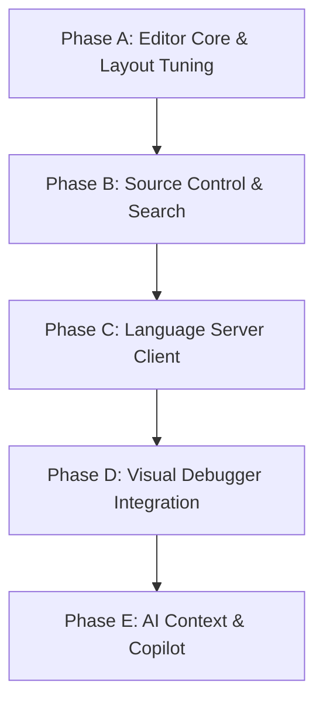

# AI-IDE 🚀

An AI-augmented C++ desktop Integrated Development Environment (IDE) built with **Qt 6**, **CMake**, and **Ninja**. AI-IDE blends classic compiler diagnostics, LSP semantic indexing, and graphical data visualizers with autonomous agentic self-repair loops.

---

## 📐 System Design & Architecture

AI-IDE is designed around a decoupled multi-process architecture. High-latency operations are offloaded asynchronously to background threads or separate subsystem engines to ensure a completely fluid, non-blocking UI.



### Layout Split Structure (`QSplitter`)
The main window utilizes a vertical `QSplitter` dividing pane resources:
*   **Top Workspace**: Tabbed `QTabWidget` hosting the `CodeEditor` instances (with custom syntax highlight logic, gutter line numbers, and gutter breakpoint circles).
*   **Bottom Pane**: Tabbed container holding horizontal/vertical recursive splits of PowerShell/Bash terminals, LLDB-MI debugger outputs, regex problems parser lists, and active AI chat models history.
*   **Left Dock Area**: Collapsible tabbed pane organizing the filesystem explorer browser, visual git status stages, LSP symbols outline, and TCP server connectivity manager.

---

## ⚡ Core Features & Subsystems

### 💻 Smart Editor & Workspace
- **Highlighter**: Custom `QSyntaxHighlighter` color-coding classes, keywords, preprocessors, values, and comments.
- **Gutters**: Vertically synchronized gutter areas handling line numbers, breakpoint markers, and git edit diff highlights (added/modified/deleted indicators).
- **LSP Integration**: Stdin/stdout JSON-RPC pipe interface with `clangd.exe` supporting fuzzy autocompletion popup overlays (`Ctrl+Space`), definition redirects, and references tracking.

### 🧠 Agentic Self-Repair Pipeline
- **Checkbox Planner**: Clickable checkboxes to configure and approve step-by-step implementation changes, accompanied by color-coded code diff editors.
- **Compile & Fix Loop**: Automatically captures compiler errors, warning diagnostics, and location lines, feeding them back into the LLM provider to recursively rebuild and self-correct files in a loop until the compile succeeds.

### 📊 Visual Debugging & AST Outline
- **AST Outline View**: Sidebar navigation sorting document namespaces, classes, methods, and functions with query filters and scroll-to-line callbacks.
- **Visualizer**: Renders collection values inside paused debugging frame scopes (gradient bar charts for 1D arrays, color heatmaps for 2D matrices, and trigonometric node-link graphs for JSON networks).

### 🐙 Git Client & 3-Pane Conflict Resolver
- **Git History Tree**: Delegate-painted commit nodes and branch track lines drawn inline next to files status logs.
- **Three-Pane Merger**: Split-view resolving git conflict markers (`<<<<<<<`, `=======`, `>>>>>>>`). Maps HEAD Local (left), Incoming Remote (right), and Editable Merged results (center) with quick-accept helpers. Stages changes automatically.

### 🐳 Target Environments & Networking
- **Compiler Redirections**: Status bar target switcher executing compile commands on the Local Host, inside WSL bash, or via workspace mounts inside Docker containers.
- **Server Manager**: Asynchronous TCP socket latency ping testing, and native SSH interactive command shell client (`ssh.exe`) integrations.

---

## 🗄️ File Structure

```text
├── add_custom_editor_and_features.py   # Single source of truth generating C++ source code
├── build.py                             # Clean, configure, build, and run automation script
├── run-app.bat                          # Launcher script injecting Qt DLLs into system PATH
├── idelogo.png                          # Bundled resource window icon
└── ai-ide/                              # Generated CMake project workspace
    ├── src/
    │   ├── main.cpp                     # Application entry point & SSL registrations
    │   ├── ai/                          # Gemini, Claude, Ollama clients & SQLite database
    │   ├── git/                         # Git status & staging handlers
    │   └── ui/                          # GUI widgets & custom delegates
    └── CMakeLists.txt                   # CMake configuration build options
```

---

## ⚙️ Getting Started

### Prerequisites
*   **Operating System**: Windows 10/11
*   **Qt 6 SDK**: Configured at `C:\Qt\6.11.1\llvm-mingw_64`
*   **Compiler Toolchain**: LLVM-MinGW (Clang/Clang++ and Ninja) configured at `C:\Qt\Tools\llvm-mingw_64`
*   **Python 3.x**: Installed and registered in your system environment PATH.

### Compilation & Launch
To configure, compile, and run the IDE immediately:
```powershell
python build.py --run
```

---

## 📜 Release Changelog History

### v1.0 Release
- Added visual Git history commit graph (node delegates).
- Added three-pane side-by-side conflict resolver.
- Added compiler target redirects selector (Local, WSL, Docker mounts).
- Added remote TCP ping server and native SSH terminals support.

### v0.9 Update - Semantic Search (Vector RAG)
- Added local SQLite databases caching embeddings vectors at `.antigravity/vector_index.db`.
- Added dynamic embedding client calling Gemini (`text-embedding-004`) or Ollama (`nomic-embed-text`).
- Added dot-product cosine similarity rankings inside a dedicated semantic search toggle UI.

### v0.8 Update - AI Connections Settings & Editor Polish
- Added provider profile credentials managers for Ollama, Gemini, Claude, and Antigravity.
- Added floating Find & Replace dialog supporting regular expressions and case filters.
- Registered OpenSSL plugin directories fixing MinGW network handshakes.

### v0.7 Update - Core IDE Subsystems
- Added persistent `clangd` JSON-RPC connection client.
- Added splittable terminals tiling recursive horizontal/vertical shell slots.
- Added editor gutter code diagnostic `💡` AI auto-fix prompts.
