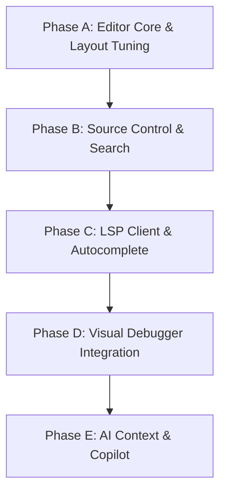

# Advanced Execution Plan: Phases A - E

This document defines the sequential execution phases to implement advanced IDE capabilities in AI-IDE.

---

## Phase A: Editor Core & Layout Tuning (Short Term)

### 🎨 Live Syntax Highlighting
*   **Implementation**: Subclass `QSyntaxHighlighter` to parse text blocks inside `QPlainTextEdit`.
*   **Rules**: Define text formatting rules (`QTextCharFormat`) mapped to regex patterns for:
    - C++ Keywords (`class`, `public`, `if`, `return`, etc.)
    - Preprocessor Directives (`#include`, `#pragma`, etc.)
    - String literals, numeric values, and single/multi-line comments.

### 🔢 Gutter Line Numbers
*   **Implementation**: Create a custom `LineNumberArea` widget helper class embedded directly inside `CustomEditor`.
*   **Behavior**: Paint line numbers inside a narrow left-aligned vertical bar. Adjust width dynamically based on total document line count. Align vertical scrolling by connecting the scrollbar's `valueChanged()` signals.

### ⌨️ Command Palette (`Ctrl+Shift+P`)
*   **Implementation**: A floating, borderless modal search bar that drops down from the top center of the editor.
*   **Behavior**: Fuzzy-matches keywords to trigger any menu item actions, file opens, or build/run commands without needing mouse interactions.

---

## Phase B: Source Control & Project Search (Short Term)

### 🛠️ Ripgrep Project Search Sidebar
*   **Implementation**: Spawn `rg.exe` asynchronously via `QProcess` in `--vimgrep` mode.
*   **Behavior**: Provide a search bar in the left sidebar that streams matching occurrences, line numbers, and file context into a double-clickable tree.

### 🌿 Visual Git Client
*   **Implementation**: Execute raw `git` commands using `QProcess` in a worker thread.
*   **Behavior**: Create a Source Control sidebar displaying added, modified, and deleted files with checkboxes to stage changes. Provide a text edit field for commit messages and visual Sync buttons (push/pull).

### 📍 Gutter Diff Indicators
*   **Implementation**: Draw subtle green, blue, and red line segments inside the editor line numbers gutter.
*   **Behavior**: Query line modifications relative to `git diff` index, updating markers dynamically as text changes.

---

## Phase C: Language Server Protocol (LSP) Client (Medium Term)

### 🖥️ clangd Process Integration
*   **Implementation**: Spawn `clangd.exe` as a persistent background process via `QProcess` in standard stdin/stdout JSON-RPC mode.
*   **Behavior**: Serialize/deserialize LSP message frames (e.g. `initialize`, `textDocument/didOpen`, `textDocument/didChange`).

### squiggly Live Error Diagnostics
*   **Implementation**: Intercept publish-diagnostics responses from clangd.
*   **Behavior**: Mark range spans with red wavy underlines (`QTextCharFormat::SpellCheckUnderline`) to alert users of errors/warnings immediately as they type, without needing to trigger a manual compiler build.

### 💡 Autocomplete Dropdown List
*   **Implementation**: Query `textDocument/completion` when user types activation triggers (like `.`, `->`, or `::`).
*   **Behavior**: Popup a list selection box at the text cursor position. Pressing `Enter` or `Tab` inserts the selected member.

---

## Phase D: Visual Debugger Integration (Medium Term)

### 🔴 Visual Gutter Breakpoints
*   **Implementation**: Bind click events in the line numbers gutter.
*   **Behavior**: Toggle red circle breakpoint indicators. If a debugging session is active, write `-break-insert <file>:<line>` or `-break-delete <id>` directly to GDB/LLDB-MI.

### 🧵 Stack Frame & Threads Inspector
*   **Implementation**: Wire stop events to parse stack lists (`-stack-list-frames`) and thread details.
*   **Behavior**: Populate sidebar panel lists. Clicking a frame redirects the code editor viewport directly to the source location.

### 💬 Hover Expression Evaluator
*   **Implementation**: Enable mouse tracking in the editor viewport.
*   **Behavior**: Extract word text under the mouse cursor when stopped, query its active value (`-data-evaluate-expression <word>`), and display the evaluation in a tooltip.

---

## Phase E: AI Context & Copilot (Long Term)

### 📝 Inline Overlay Prompt (`Ctrl+I`)
*   **Implementation**: Floating textbox widget positioned right at the editor cursor.
*   **Behavior**: Passes the highlighted selection + instruction to the AI provider. Displays proposals as inline side-by-side diff changes, allowing users to review and accept/discard changes.

### 🤖 Keystroke Ghost-Text Autocomplete
*   **Implementation**: Debounce typing events.
*   **Behavior**: Fetch fast code suggestions from a lightweight local Ollama model (`deepseek-coder`). Render proposals in-place as italicized gray text. Accept suggestions by pressing `Tab`.

### 🗄️ Workspace Embedding RAG
*   **Implementation**: Extract text chunks and vector embeddings of all repository files.
*   **Behavior**: Store indices in SQLite. Provide the AI Chat panel with vector search queries, enabling the AI to answer chat prompts with full semantic repository context.
