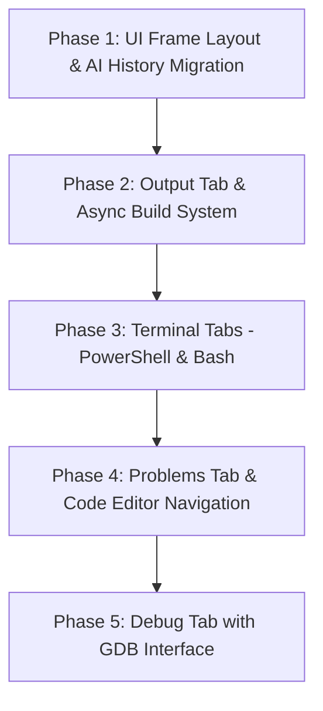

# Phase Progression & System Design: Bottom Tab Pane (Terminal, Debug, Problems, Output, and AI History)

This document contains recommendations, architectural designs, and a phased execution plan for adding a bottom tab pane below the central text editor in AI-IDE.

---

## 1. Architectural Layout Suggestions

There are two primary approaches to implement the bottom pane in Qt:

### Option A: Central Widget Splitter (`QSplitter`) - **Recommended**
Change the central widget of `EditorWindow` from a simple `QTabWidget` (for editor files) to a vertical `QSplitter`.
*   **Top Widget**: `QTabWidget` (file editor tabs).
*   **Bottom Widget**: A new `QTabWidget` (Terminal, Debug, Problems, Output, AI History).
*   **Pros**: Keeps the console/terminal strictly aligned beneath the text editor, matching VS Code's behavior. Resizes cleanly and doesn't conflict with dock widgets on the left/right.

### Option B: Bottom Dock Widget (`QDockWidget`)
Create a single dock widget in the `Qt::BottomDockWidgetArea` containing a `QTabWidget` with all the tabs.
*   **Pros**: Highly flexible. Tabs can be floated into a separate window or closed entirely.
*   **Cons**: Dock layouts can sometimes be finicky to constrain, and it spans across the entire bottom (underneath the left File dock and right Chat dock), which may crowd the side panels.

---

## 2. Technical Design of the Tabs

### A. Terminal Tab (C++ Terminal Emulators)
For a Windows LLVM-MinGW environment, we recommend the following progression for the terminal backend:

1.  **Level 1 (Basic QProcess + Text Box)**: 
    *   Spawn `powershell.exe` using `QProcess`.
    *   Forward `QProcess::readyReadStandardOutput` and `readyReadStandardError` to a read-only `QPlainTextEdit`.
    *   Intercept keystrokes in `QPlainTextEdit` (e.g., in `keyPressEvent`) and forward them via `QProcess::write()`.
    *   *Limitation*: No ANSI color support or full terminal screen drawing (like Vim).
2.  **Level 2 (ANSI Escape Code Parser)**:
    *   Enhance Level 1 by parsing standard VT100/ANSI escape codes (e.g., `\033[31m` for red text) and converting them into HTML styles (`...`) to display in a `QTextEdit`.
3.  **Level 3 (Windows ConPTY integration - Advanced)**:
    *   Use the Windows Pseudo Console (ConPTY) API (available in Windows 10+). ConPTY handles PTY emulation natively.
    *   Communicate with ConPTY via raw pipes and render the text in a grid.
    *   *Pros*: Fully interactive shell supporting interactive Git commands, curl progress bars, Vim, and arrow-key history.

**Recommendation**: We propose starting with **Level 1 (Basic QProcess + Text Box)** with a simple ANSI color parser in the early phases to get a functional, cross-platform terminal shell running inside the IDE, and leave full ConPTY integration as an advanced step.

### B. Output Tab
*   **Requirements**: A read-only `QPlainTextEdit` displaying logs from build tasks.
*   **Implementation**: When building (e.g. running `python build.py`), spawn the build as an asynchronous `QProcess` in `EditorWindow` rather than a blocking command, and direct all build stdout to the Output tab.

### C. Problems Tab
*   **Requirements**: A `QTreeView` or `QTableWidget` listing compiler diagnostics.
*   **Implementation**: Parse the output of `build.py` using regular expressions to capture warning/error patterns (e.g., `filename:line:col: error: message`). Populate these into a list.
*   **Navigation**: Double-clicking a row triggers a custom signal that opens the file in the central editor and scrolls the cursor to the target line.

### D. Debug Tab
*   **Requirements**: Control buttons (Play, Pause, Step Over, Step Into, Stop), thread list, call stack, and variable watch.
*   **Implementation**: Implement a basic wrapper around GDB/LLDB command-line outputs (`-interpreter=mi2` interface) using `QProcess`, parsing output streams to update local variables and stack trace highlights.

### E. AI History Tab (Migration)
*   **Requirements**: Move the existing `QListView` and `historyModel` from the right dock window to this tab pane.
*   **Implementation**: Extract history widget creation from `createDocks()` and add it as a tab in the bottom tab pane, ensuring the connection to the AIChatPanel stays intact.

### F. Bash Shell Tab (Recommended Terminal)
On a Windows C++ development system, we recommend using **Git Bash** (typically located at `C:\Program Files\Git\bin\bash.exe`) or falling back to **Windows Subsystem for Linux (WSL)** (`wsl.exe`) or any `bash` in the system path. 
*   **Location**: It should be added as a **separate tab** alongside the Windows-native shell (PowerShell). Having dedicated "PowerShell" and "Bash" tabs provides a simple, clean, and distraction-free user interface.
*   **Implementation**: Spawns `bash.exe --login -i` via `QProcess` in a separate `TerminalWidget` instance, handling standard shell command operations and keystroke capturing similarly to the PowerShell tab.

---

## 3. Proposed Phased Execution Plan

To build this systematically without breaking the existing codebase, we propose the following 5 phases:

### Phase 1: UI Frame Layout & AI History Migration
*   Refactor the central area of `EditorWindow` to use a vertical `QSplitter`.
*   Create the bottom `QTabWidget`.
*   Add empty placeholder tabs for PowerShell, Bash, Debug, Problems, and Output.
*   Migrate the **AI History** `QListView` and its model (`historyModel`) from the right dock to the new bottom tab bar.
*   *Verification*: Compile and check that the layout is stable and that double-clicking items in AI History still functions correctly.

### Phase 2: Output Tab & Asynchronous Build Integration
*   Build an asynchronous compilation manager in `EditorWindow` that runs `python build.py` using `QProcess`.
*   Redirect build outputs to the **Output** tab in real-time.
*   Add a visual indicator (like a progress spinner or a colored status bar message) while building is in progress.
*   *Verification*: Run a build and watch the build log populate the Output tab as it compiles.

### Phase 3: Terminal Tabs (PowerShell & Bash)
*   Create a custom `TerminalWidget` containing a specialized `QPlainTextEdit` for input/output.
*   Instantiate two terminal tabs: **PowerShell** (spawning `powershell.exe`) and **Bash** (spawning Git Bash `bash.exe` or fallback).
*   Implement standard input redirection on keypress and output routing to the text widgets.
*   Add a simple ANSI color strip filter for clean rendering.
*   *Verification*: Open each terminal tab and run commands (e.g., `dir` / `ls`, `mkdir`, `python -v`) to check that both shells execute and return output correctly.

### Phase 4: Problems Tab & Compiler Diagnostic Parsing
*   Add regular expression filters to the build `QProcess` output from Phase 2.
*   Extract build errors and warnings, and display them in a list view in the **Problems** tab.
*   Add an editor navigation slot so clicking an error opens the file and highlights the line.
*   *Verification*: Inject a syntax error into a generated file, run build, and verify that the error appears in the Problems tab and can be double-clicked to open.

### Phase 5: Debug Tab (GDB Wrapper Skeleton)
*   Add a control bar with step buttons and a text panel for variables.
*   Spawn a debugger command line process under GDB, configuring breakpoints on active code lines.
*   *Verification*: Step through a simple script or binary session.
