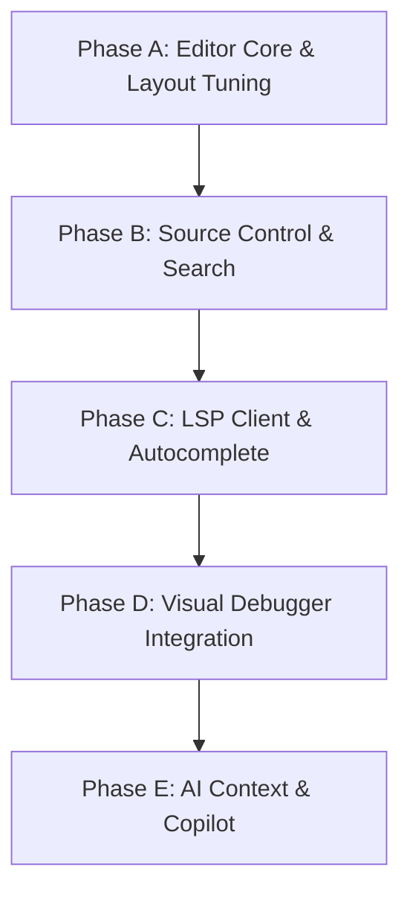

# AI-IDE Advanced Feature Roadmap 🚀

This document outlines high-impact architectural and feature enhancements to transition AI-IDE from a functional desktop framework into a premium, production-ready developer workspace.

---

## 1. Advanced Editor Enhancements

### 🎨 Live Syntax Highlighting
*   **Concept**: Colorize source files (C++, Python, Markdown, JSON) dynamically.
*   **Tech Stack**: Implement a custom subclass of `QSyntaxHighlighter` mapped to code editor documents. Define regex rules or map token states for keywords, types, string literals, comments, and preprocessor directives.

### 🔢 Gutter Line Numbers & Visual Breakpoints
*   **Concept**: Add a sidebar gutter for line numbers and clicking to set breakpoints.
*   **Tech Stack**: Create a custom `LineNumberArea` widget that sits inside `CustomEditor` alongside the `QPlainTextEdit` viewport. Draw line numbers dynamically on paint events. Intercept click events to toggle visual red breakpoint dots (storing line states).

### 🔍 Language Server Protocol (LSP) Client (clangd Integration)
*   **Concept**: Real-time error squiggles, autocomplete suggestions, and jump-to-definition.
*   **Tech Stack**: Launch LLVM's `clangd.exe` (found in the toolchain directory) in the background via `QProcess` in JSON-RPC stdin/stdout mode. Implement a lightweight LSP client in C++ to exchange document synchronization and diagnostics. Show hover tooltips and live red squiggly underlines under syntax issues *before* building.

---

## 2. Next-Gen AI Integration

### ⌨️ Inline AI Coding Assistant (`Ctrl+I`)
*   **Concept**: Inline overlay to refactor code blocks or generate code directly under the cursor.
*   **Tech Stack**: Capture a custom shortcut (`Ctrl+I`) to spawn a borderless widget overlay in the active editor. On prompt submission, send the context of the active file + selection to the AI provider, draw the changes as a real-time inline diff inside the editor block, and allow tab-accepting.

### 🤖 Local Copilot-Style Autocomplete
*   **Concept**: Real-time grey ghost-text suggestions as you type.
*   **Tech Stack**: Monitor editor keystrokes with short debounce timers. Query a small local model (e.g. `deepseek-coder` or `qwen-code` running on Ollama) asynchronously in the background. Display proposals as gray italicized inline text that the user can accept by pressing `Tab`.

### 🗄️ Workspace Context RAG (Semantic Search)
*   **Concept**: Chat with the AI using full workspace repository awareness.
*   **Tech Stack**: Chunk and embed all project files into a local SQLite database (using `sqlite-vec` or raw vector array indices). Integrate local embeddings extraction, enabling the AI Chat panel to do semantic retrieval (RAG) to find files and methods across the whole project context when answering questions.

---

## 3. Terminal & Console Enhancements

### 🖥️ Full ANSI/VT Terminal Emulator
*   **Concept**: Clean interactive terminal supporting color escapes, vim, and raw shell animations.
*   **Tech Stack**: Replace `QPlainTextEdit` terminals with a true terminal parser. Parse VT100/ANSI escape codes dynamically using a state machine (or integrate a Qt-compatible libqterm/xterm-like text grid). Support interactive keyboard sequences (backspace, arrow history, Ctrl+C interrupt signals).

---

## 4. Visual Debugger Improvements

### 🐛 Visual Call Stack & Thread Viewer
*   **Concept**: Side panels showing the active thread listing and stack frames list when paused.
*   **Tech Stack**: Wire debugger stop triggers to send `-thread-info` and `-stack-list-frames` to GDB/LLDB-MI. Populate a stack viewer panel, allowing the user to click a stack frame to jump directly to that context in the code editor.

### 💬 Inline Debug Value Tooltips
*   **Concept**: Hovering over a variable while debugging displays a tooltip of its active value.
*   **Tech Stack**: Enable tooltips on `CustomEditor`'s viewport. When paused, detect the word under the mouse cursor, send a background query to GDB/LLDB (`-data-evaluate-expression <word>`), and render the result in a QToolTip.

---

## 5. File Management & Git Integration

### 🛠️ Folder Search / Ripgrep Integration
*   **Concept**: A sidebar panel to search text strings across all project files.
*   **Tech Stack**: Add a Search icon/panel in the sidebar. Run `rg.exe` (ripgrep) asynchronously via `QProcess` with `--vimgrep` parameters. Stream matching filenames, line numbers, and contents into a hierarchical `QTreeWidget` that jumps to files on double-click.

### 🌿 Visual Source Control Dashboard
*   **Concept**: A tab showing modified files, git diffs, staging areas, and committing.
*   **Tech Stack**: Fully implement `GitClient` to query `git status --porcelain` and `git diff`. Display changed files in a tree with status icons (Added, Modified, Deleted). Include a commit message box and Sync (Push/Pull) buttons.

---

## 6. Personalization & Workspace Control

### 🎨 Theme Customization & Extensibility
*   **Concept**: Custom visual themes (Monokai, Material Dark, One Light) switching on the fly.
*   **Tech Stack**: Establish a global styling manager that loads Qt Style Sheets (QSS) dynamically. Implement a Theme picker that updates QSS properties and editor color schemes globally without restarting the application.

### ⌨️ Command Palette (`Ctrl+Shift+P`)
*   **Concept**: Floating overlay search bar to execute IDE commands quickly.
*   **Tech Stack**: Create a centered dropdown dialog that lists all actions (new file, build, theme picker, debug settings). Support fuzzy searching to run any menu action immediately via keyboard commands.

---

## 7. Phased Implementation Plan

We propose executing these upgrades in 5 sequential phases to build up core developer features systematically.

### Phase A: Editor Core & Layout Tuning (Short Term)
*   **Syntax Highlighting**: Subclass `QSyntaxHighlighter` for C++ and Python token colorization.
*   **Line Numbers Gutter**: Implement a line number area widget positioned left-adjacent to the `QPlainTextEdit` viewport, aligning vertically on scroll events.
*   **Command Palette**: Build a search-centric dropdown popup (`Ctrl+Shift+P`) to quickly execute IDE commands.
*   *Verification*: Launch IDE, confirm line numbers dynamically draw, code highlights cleanly, and palette triggers search lists.

### Phase B: Source Control & Project Search (Short Term)
*   **Ripgrep Sidebar**: Add a search explorer panel. Run `rg.exe` asynchronously to display multi-file grep search hits in a clickable tree.
*   **Visual Git Client**: Fully implement status queries, staging checkboxes, a commit text box, and push/pull buttons in the Source Control panel.
*   **Gutter Diff Indicators**: Draw subtle blue/green/red markers in the line gutter next to code lines changed relative to `git HEAD`.
*   *Verification*: Run text searches across the folder, stage files visually, commit them, and check that modified editor lines draw gutter markers.

### Phase C: Language Server Protocol (LSP) Client (Medium Term)
*   **clangd Process Integration**: Spawn `clangd.exe` via `QProcess` in standard stdin/stdout JSON-RPC mode.
*   **Live Error Diagnostics**: Parse live LSP diagnostic notices to draw red wavy underlines under compiler issues as the user types.
*   **Completion Dropdown**: Intercept character inputs (like `.`, `->`, `::`) to fetch autocomplete lists and show them in a floating menu box.
*   *Verification*: Type broken code in a document, verify red underlines show immediately without building, and confirm autocomplete overlays trigger correctly.

### Phase D: Visual Debugger Integration (Medium Term)
*   **Visual Gutter Breakpoints**: Connect line number gutter click events to issue `-break-insert` commands to GDB/LLDB-MI. Draw a red circle marker in the gutter.
*   **Call Stack & Threads Tree**: Parse frame listings on stop events and display threads and stack levels in sidebar tree lists.
*   **Hover Value Evaluator**: Enable tooltips in the editor viewport to query variables under the mouse cursor via `-data-evaluate-expression`.
*   *Verification*: Set breakpoint in gutter, click debug, verify GDB hits the line, and hover over variables to see tooltips showing active states.

### Phase E: AI Context & Copilot (Long Term)
*   **Inline overlay (`Ctrl+I`)**: Create a cursor-aligned floating textbox prompt. Refactor local selections and display inline side-by-side diff previews directly in the document.
*   **Keystroke Copilot Autocomplete**: Run debounce timers on typing to call a local Ollama model (`deepseek-coder`) and show ghost-text autocompletions.
*   **Local Project Embeddings**: Extract code embeddings and index files into a sqlite vector database, allowing conversational RAG over the full workspace.
*   *Verification*: Select a method, press `Ctrl+I`, write a refactor command, and verify changes show inline. Verify ghost text autocompletions complete on `Tab`.
